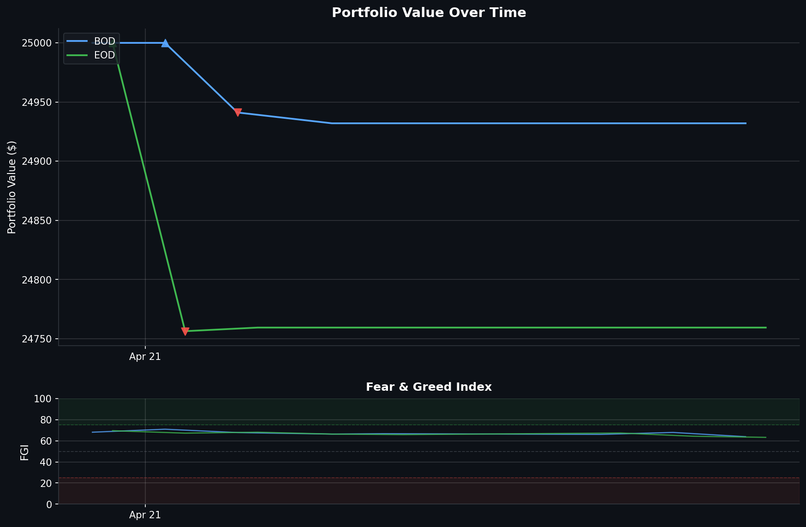

# Fear & Greed Index Trading Bot

> Dashboard auto-updated daily at market close | Last update: **2026-04-29 13:30 PST**

---

## BOD (Morning) Strategy

| Metric | Value |
|--------|-------|
| Portfolio Value | **$24,932.04** |
| Buying Power | $49,864.08 |
| Current FGI | 63.83 |
| Position | FLAT |
| Total P&L | **$-68** |
| Win Rate | 0% (0W / 1L) |
| Total Round Trips | 1 |
| Last Signal | NO_ACTION @ 2026-04-29 06:30 |

Trade History (1 trades)

| Buy Date | Sell Date | Buy Price | Sell Price | Qty | P&L | Return | Result |
|----------|-----------|-----------|------------|-----|-----|--------|--------|
| 2026-04-21 | 2026-04-22 | $710.20 | $709.24 | 70 | $-68 | -0.14% | LOSS |

Recent Activity (last 5 entries)

| Time | Action | Price | FGI | Momentum | Velocity | Volatility | Reason |
|------|--------|-------|-----|----------|----------|------------|--------|
| 04-29 06:30 | NO_ACTION | $710.85 | 63.83 | -2.08 | -0.95 | 0.1456 | Insufficient momentum/velocity for entry |
| 04-28 06:30 | NO_ACTION | $711.82 | 67.86 | 1.00 | 0.52 | 0.1442 | Strong momentum/velocity, low volatility |
| 04-27 06:30 | NO_ACTION | $713.19 | 66.03 | -0.31 | -0.57 | 0.1655 | Insufficient momentum/velocity for entry |
| 04-24 06:30 | NO_ACTION | $710.99 | 66.69 | -0.22 | -1.41 | 0.1841 | Insufficient momentum/velocity for entry |
| 04-23 13:42 | NO_ACTION | $708.45 | 66.31 | -2.01 | -0.59 | 0.1818 | Insufficient momentum/velocity for entry |

---

## EOD (Afternoon) Strategy

| Metric | Value |
|--------|-------|
| Portfolio Value | **$24,759.44** |
| Buying Power | $49,518.88 |
| Current FGI | 63.23 |
| Position | FLAT |
| Total P&L | **$-323** |
| Win Rate | 0% (0W / 1L) |
| Total Round Trips | 1 |
| Last Signal | NO_ACTION @ 2026-04-29 13:10 |

Trade History (1 trades)

| Buy Date | Sell Date | Buy Price | Sell Price | Qty | P&L | Return | Result |
|----------|-----------|-----------|------------|-----|-----|--------|--------|
| 2026-04-20 | 2026-04-21 | $708.76 | $704.15 | 70 | $-323 | -0.65% | LOSS |

Recent Activity (last 5 entries)

| Time | Action | Price | FGI | Momentum | Velocity | Volatility | Reason |
|------|--------|-------|-----|----------|----------|------------|--------|
| 04-29 13:10 | NO_ACTION | $711.63 | 63.23 | -1.71 | -0.86 | 0.1456 | Insufficient momentum/velocity for entry |
| 04-28 13:10 | NO_ACTION | $711.54 | 64.26 | -1.54 | -0.68 | 0.1442 | Insufficient momentum/velocity for entry |
| 04-27 13:10 | NO_ACTION | $715.10 | 67.34 | 0.86 | -0.25 | 0.1655 | Insufficient momentum/velocity for entry |
| 04-24 13:10 | NO_ACTION | $713.97 | 65.8 | -0.93 | -0.47 | 0.1841 | Insufficient momentum/velocity for entry |
| 04-23 13:42 | NO_ACTION | $708.45 | 66.31 | -0.89 | -1.07 | 0.1818 | Insufficient momentum/velocity for entry |

---

## Strategy

Momentum-based strategy using CNN Fear & Greed Index to trade SPY.

| Parameter | Value |
|-----------|-------|
| Momentum Threshold | 0.2 |
| Velocity Threshold | 0.15 |
| Volatility Buy Limit | 0.6 |
| Volatility Sell Limit | 0.5 |
| Max Days Held | 8 |
| Lookback Days | 3 |
| BOD Execution | 6:20 AM PST |
| EOD Execution | 1:10 PM PST |
