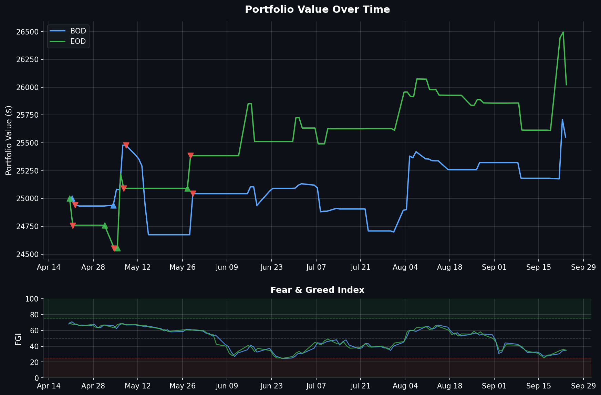

# Fear & Greed Index Trading Bot

> Dashboard auto-updated daily at market close | Last update: **2026-08-27 13:30 PST**

---

## BOD (Morning) Strategy

| Metric | Value |
|--------|-------|
| Portfolio Value | **$25,322.54** |
| Buying Power | $98,526.95 |
| Current FGI | 54.0 |
| Position | FLAT |
| Total P&L | **$+995** |
| Win Rate | 50% (1W / 1L) |
| Total Round Trips | 2 |
| Last Signal | NO_ACTION @ 2026-08-27 09:35 |

Trade History (2 trades)

| Buy Date | Sell Date | Buy Price | Sell Price | Qty | P&L | Return | Result |
|----------|-----------|-----------|------------|-----|-----|--------|--------|
| 2026-04-21 | 2026-04-22 | $710.20 | $709.24 | 70 | $-68 | -0.14% | LOSS |
| 2026-05-04 | 2026-05-08 | $719.65 | $735.05 | 69 | $+1,063 | +2.14% | WIN |

Recent Activity (last 5 entries)

| Time | Action | Price | FGI | Momentum | Velocity | Volatility | Reason |
|------|--------|-------|-----|----------|----------|------------|--------|
| 08-27 09:35 | NO_ACTION | $767.41 | 54.0 | -1.57 | -0.22 | 0.55 | SELL incomplete - still holding 32 after 5 attempts |
| 08-26 09:35 | NO_ACTION | $765.67 | 56.66 | 0.87 | 1.21 | 0.55 | BUY did not fill after 3 attempts |
| 08-25 09:35 | NO_ACTION | $766.64 | 56.06 | 1.48 | -0.31 | 0.55 | Insufficient momentum/velocity for entry |
| 08-24 09:35 | NO_ACTION | $763.34 | 54.66 | -0.24 | -0.20 | 0.55 | Insufficient momentum/velocity for entry |
| 08-21 09:35 | NO_ACTION | $764.81 | 53.03 | -2.07 | -1.89 | 0.55 | Insufficient momentum/velocity for entry |

---

## EOD (Afternoon) Strategy

| Metric | Value |
|--------|-------|
| Portfolio Value | **$25,886.62** |
| Buying Power | $103,546.48 |
| Current FGI | 58.14 |
| Position | FLAT |
| Total P&L | **$+302** |
| Win Rate | 50% (2W / 2L) |
| Total Round Trips | 4 |
| Last Signal | NO_ACTION @ 2026-08-27 15:50 |

Trade History (4 trades)

| Buy Date | Sell Date | Buy Price | Sell Price | Qty | P&L | Return | Result |
|----------|-----------|-----------|------------|-----|-----|--------|--------|
| 2026-04-20 | 2026-04-21 | $708.76 | $704.15 | 70 | $-323 | -0.65% | LOSS |
| 2026-05-01 | 2026-05-04 | $720.42 | $717.38 | 68 | $-207 | -0.42% | LOSS |
| 2026-05-05 | 2026-05-07 | $723.86 | $731.90 | 67 | $+539 | +1.11% | WIN |
| 2026-05-27 | 2026-05-28 | $750.78 | $755.22 | 66 | $+293 | +0.59% | WIN |

Recent Activity (last 5 entries)

| Time | Action | Price | FGI | Momentum | Velocity | Volatility | Reason |
|------|--------|-------|-----|----------|----------|------------|--------|
| 08-27 15:50 | NO_ACTION | $770.53 | 58.14 | 0.56 | 0.97 | 0.55 | BUY did not fill after 3 attempts |
| 08-26 15:52 | NO_ACTION | $767.11 | 55.74 | -0.87 | 0.08 | 0.55 | SELL incomplete - still holding 33 after 5 attempts |
| 08-25 15:50 | NO_ACTION | $765.34 | 58.86 | 2.33 | 2.00 | 0.55 | BUY did not fill after 3 attempts |
| 08-24 15:52 | NO_ACTION | $763.90 | 55.23 | 0.70 | -0.51 | 0.55 | SELL incomplete - still holding 33 after 5 attempts |
| 08-21 15:50 | NO_ACTION | $766.56 | 55.51 | 0.46 | 0.31 | 0.55 | BUY did not fill after 3 attempts |

---

## Strategy

Momentum-based strategy using CNN Fear & Greed Index to trade SPY.

| Parameter | Value |
|-----------|-------|
| Momentum Threshold | 0.2 |
| Velocity Threshold | 0.15 |
| Volatility Buy Limit | 0.6 |
| Volatility Sell Limit | 0.5 |
| Max Days Held | 8 |
| Lookback Days | 3 |
| BOD Execution | 6:20 AM PST |
| EOD Execution | 1:10 PM PST |
