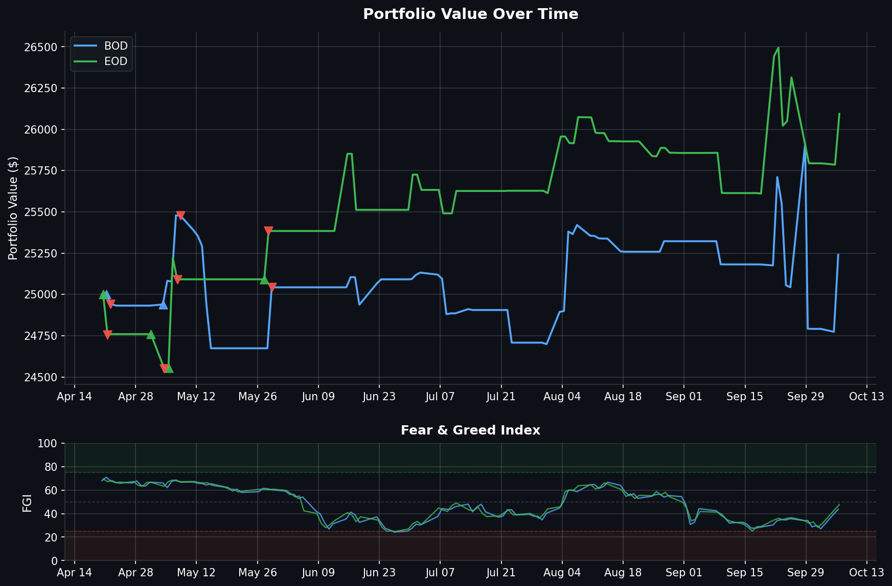

# Fear & Greed Index Trading Bot

> Dashboard auto-updated daily at market close | Last update: **2026-10-02 13:30 PST**

---

## BOD (Morning) Strategy

| Metric | Value |
|--------|-------|
| Portfolio Value | **$24,791.14** |
| Buying Power | $99,164.56 |
| Current FGI | 27.17 |
| Position | FLAT |
| Total P&L | **$+995** |
| Win Rate | 50% (1W / 1L) |
| Total Round Trips | 2 |
| Last Signal | NO_ACTION @ 2026-10-02 09:35 |

Trade History (2 trades)

| Buy Date | Sell Date | Buy Price | Sell Price | Qty | P&L | Return | Result |
|----------|-----------|-----------|------------|-----|-----|--------|--------|
| 2026-04-21 | 2026-04-22 | $710.20 | $709.24 | 70 | $-68 | -0.14% | LOSS |
| 2026-05-04 | 2026-05-08 | $719.65 | $735.05 | 69 | $+1,063 | +2.14% | WIN |

Recent Activity (last 5 entries)

| Time | Action | Price | FGI | Momentum | Velocity | Volatility | Reason |
|------|--------|-------|-----|----------|----------|------------|--------|
| 10-02 09:35 | NO_ACTION | $770.74 | 27.17 | -1.43 | -2.34 | 0.1049 | Insufficient momentum/velocity for entry |
| 10-01 09:35 | NO_ACTION | $764.75 | 29.94 | -1.00 | -1.33 | 0.1075 | Insufficient momentum/velocity for entry |
| 09-30 09:35 | NO_ACTION | $766.74 | 28.69 | -3.59 | -2.34 | 0.1081 | Insufficient momentum/velocity for entry |
| 09-29 09:35 | NO_ACTION | $765.87 | 34.2 | -0.42 | -0.14 | 0.1103 | SELL incomplete - still holding 64 after 5 attempts |
| 09-28 18:50 | NO_ACTION | $765.60 | 33.94 | -0.82 | -0.31 | 0.1109 | SELL incomplete - still holding 66 after 5 attempts |

---

## EOD (Afternoon) Strategy

| Metric | Value |
|--------|-------|
| Portfolio Value | **$25,793.72** |
| Buying Power | $103,174.88 |
| Current FGI | 31.31 |
| Position | FLAT |
| Total P&L | **$+302** |
| Win Rate | 50% (2W / 2L) |
| Total Round Trips | 4 |
| Last Signal | NO_ACTION @ 2026-10-02 15:50 |

Trade History (4 trades)

| Buy Date | Sell Date | Buy Price | Sell Price | Qty | P&L | Return | Result |
|----------|-----------|-----------|------------|-----|-----|--------|--------|
| 2026-04-20 | 2026-04-21 | $708.76 | $704.15 | 70 | $-323 | -0.65% | LOSS |
| 2026-05-01 | 2026-05-04 | $720.42 | $717.38 | 68 | $-207 | -0.42% | LOSS |
| 2026-05-05 | 2026-05-07 | $723.86 | $731.90 | 67 | $+539 | +1.11% | WIN |
| 2026-05-27 | 2026-05-28 | $750.78 | $755.22 | 66 | $+293 | +0.59% | WIN |

Recent Activity (last 5 entries)

| Time | Action | Price | FGI | Momentum | Velocity | Volatility | Reason |
|------|--------|-------|-----|----------|----------|------------|--------|
| 10-02 15:50 | NO_ACTION | $769.65 | 31.31 | 0.42 | -0.14 | 0.1035 | Insufficient momentum/velocity for entry |
| 10-01 15:50 | NO_ACTION | $765.14 | 28.46 | -2.58 | -1.83 | 0.1074 | Insufficient momentum/velocity for entry |
| 09-30 15:50 | NO_ACTION | $764.73 | 32.91 | 0.05 | -1.22 | 0.1076 | Insufficient momentum/velocity for entry |
| 09-29 15:50 | NO_ACTION | $764.24 | 31.74 | -2.34 | -1.42 | 0.1105 | SELL incomplete - still holding 66 after 5 attempts |
| 09-28 18:50 | NO_ACTION | $765.60 | 33.94 | -1.56 | -0.32 | 0.1109 | SELL incomplete - still holding 66 after 5 attempts |

---

## Strategy

Momentum-based strategy using CNN Fear & Greed Index to trade SPY.

| Parameter | Value |
|-----------|-------|
| Momentum Threshold | 0.2 |
| Velocity Threshold | 0.15 |
| Volatility Buy Limit | 0.6 |
| Volatility Sell Limit | 0.5 |
| Max Days Held | 8 |
| Lookback Days | 3 |
| BOD Execution | 6:20 AM PST |
| EOD Execution | 1:10 PM PST |
